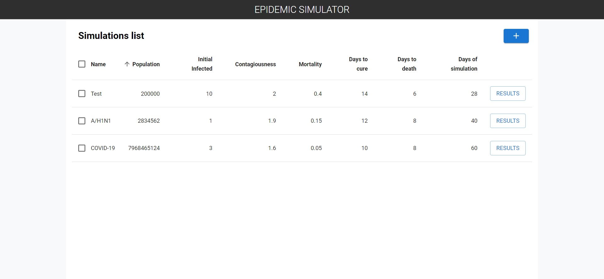
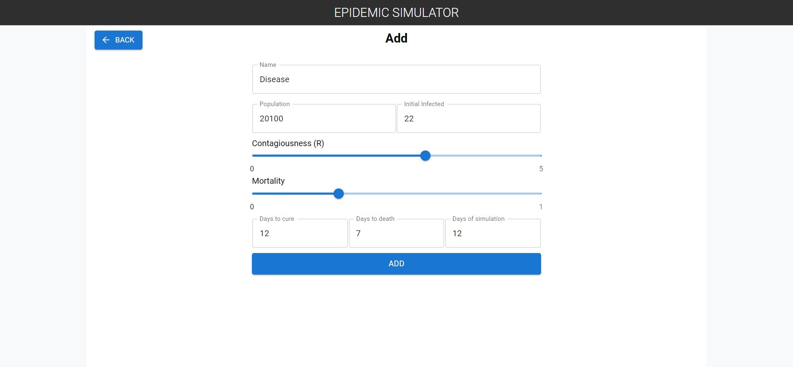
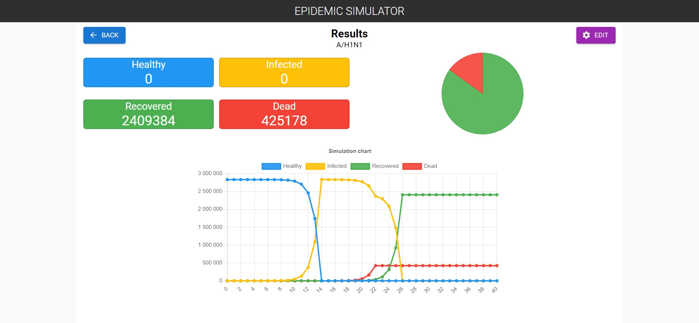
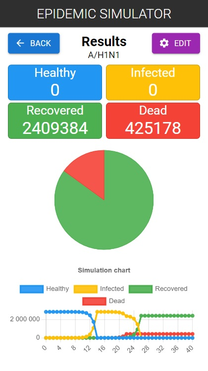
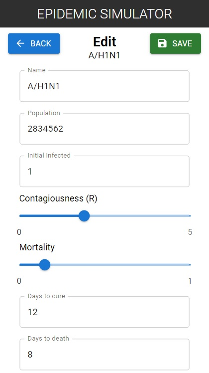

# Epidemic Simulator

## Table of contents
* [General info](#general-info)
* [Technologies](#technologies)
* [Screenshots](#screenshots)
* [Installation](#installation)
* [Available scripts](#available-scripts)
* [Live demo](#live-demo)

## General info
This project was created along the following lines
"The system user will create simulations -- for each of them, he will ask initial
parameters:
* N - Name of the simulation (string)
* P - population size
* I - initial number of infected people
* R - an indicator of how many people, one infected person infects, i.e., the familiar news
covid indicator R
* M - mortality rate, which determines how many of those infected die
* Ti - the number of days that elapse between infection and recovery of the sick person
* Tm - the number of days that elapse between infection and the death of the patient.
* Ts - the number of days for which the simulation is to be carried out.

The simulation will thus be an object containing the following data (N, P, I, R, M, Ti, Tm, Ts).
After defining the simulation, the system will generate the initial population, that is, a record containing information about:
Pi - the number of infected people
Pv - the number of healthy people susceptible to infection
Pm - the number of people who died
Pr - the number of people who have recovered and acquired immunity

It will then iteratively create successive objects containing the data set (Pi, Pv, Pm, Pr), for
successive days of simulation -- in each successive object, the number of people in each group will change according to the rules:

* M of those infected Tm days earlier will unfortunately move from the group of infected people to the
group of deceased persons
* All of the people infected Ti days earlier (and alive...) move from the group of infected people to the
group of people who have recovered and acquired immunity
* Each infected person infects R healthy susceptible people
Thus, as a result of the simulation carried out, for example, for 100 days, we will get 100 objects (Pi, Pv, Pm, Pr),
where Pi + Pv + Pm + Pr = P"


## Technologies
| Tech                                                    | Description                              |
| ------------------------------------------------------- | ---------------------------------------- |
| [TypeScript](https://www.typescriptlang.org/)                           | TypeScript is a strongly typed programming language that builds on JavaScript   |
| [React](https://reactjs.org/)                           | A JavaScript library for building user interfaces   |
| [ReactRouter](https://reactrouter.com/)                           | React Router is a standard library for routing in React   |
| [Material UI](https://mui.com/)                           | Open-source project that features React components that implement Google's Material Design   |
| [Sass](https://sass-lang.com/)                           | Professional grade CSS extension   |
| [Vite](https://vitejs.dev/)                           | build tool that aims to provide a faster and leaner development experience   |


## Screenshots
<p align="center">
    
</p>
<p align="center">
    
</p>

<p align="center">
    
</p>

<p align="center">
    
</p>

<p align="center">
    
</p>

## Installation

```bash
git clone https://github.com/MobbySchiller/epidemic-simulator.git
npm install
npm run dev
```

## Available scripts
| Command                   | Description                   |
| ------------------------- | ----------------------------- |
| `npm run dev`           | Open local server             |
| `npm run build`           | Create optimized build        |
| `npm run preview`            | Run local server on build version                    |

## Live demo
[Click here](https://mobbyschiller.github.io/epidemic-simulator/)
